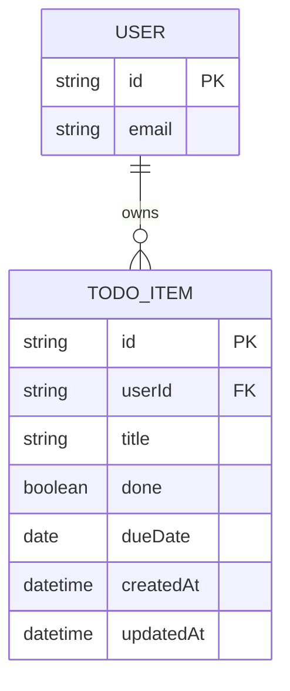

# Domain Model

A signed-in user owns a personal list of todo items. Each item belongs to
exactly one user, identified by the sign-in subject.

`USER` is not stored by this system — it is the identity Thunder asserts on
every request (the token's `sub`). `TODO_ITEM` is the one persisted entity,
scoped to its owning user on every read and write.