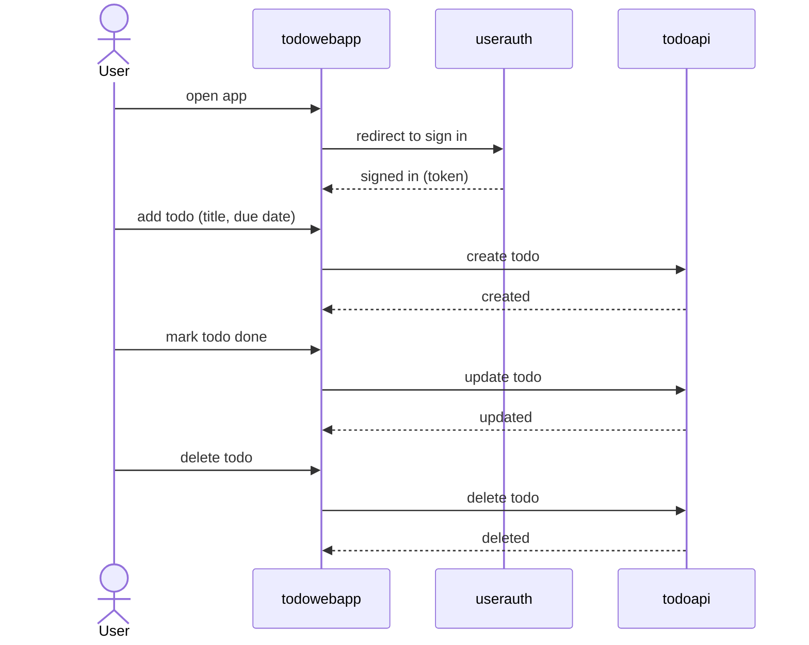

# Sign In and Manage Todos

A user signs in through the platform's SSO and then adds, completes and
removes items on their own private todo list.

```mermaid
sequenceDiagram
    actor User
    participant todowebapp
    participant userauth
    participant todoapi

    User->>todowebapp: open app
    todowebapp->>userauth: redirect to sign in
    userauth-->>todowebapp: signed in (token)
    User->>todowebapp: add todo (title, due date)
    todowebapp->>todoapi: create todo
    todoapi-->>todowebapp: created
    User->>todowebapp: mark todo done
    todowebapp->>todoapi: update todo
    todoapi-->>todowebapp: updated
    User->>todowebapp: delete todo
    todowebapp->>todoapi: delete todo
    todoapi-->>todowebapp: deleted
```

